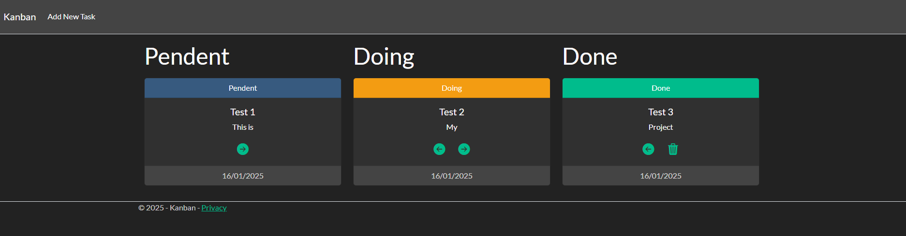
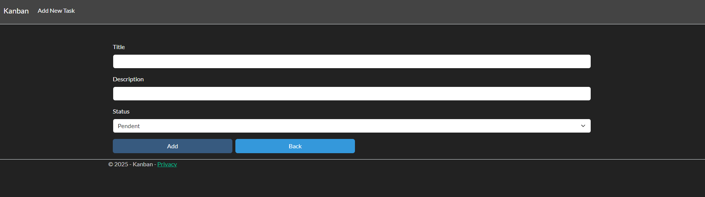

# **Kanban**
# 📋 About the Project
### A **Kanban system** developed with **ASP.NET Core** to manage tasks in a visual and efficient way. Ideal for tracking workflows, prioritizing activities, and improving productivity.

# 🚀 Technologies Used

- ### **C#** and **ASP.NET Core**
- ### **Entity Framework** (EF Core)
- ### **HTML5** and **CSS3**
- ### **SQL Server** for database management
- ### **Bootstrap** for responsive design and UI components
- ### **Razor** for rendering views

 
 

# 🛠️ Features
- ### **Add tasks**: Create new tasks and organize them into columns.
- ### **Move tasks**: Use arrows to move tasks between columns to manage workflow.
- ### **Delete tasks**: Remove completed tasks.
- ### **Status filters**: View tasks based on their status (pending, in progress, completed).